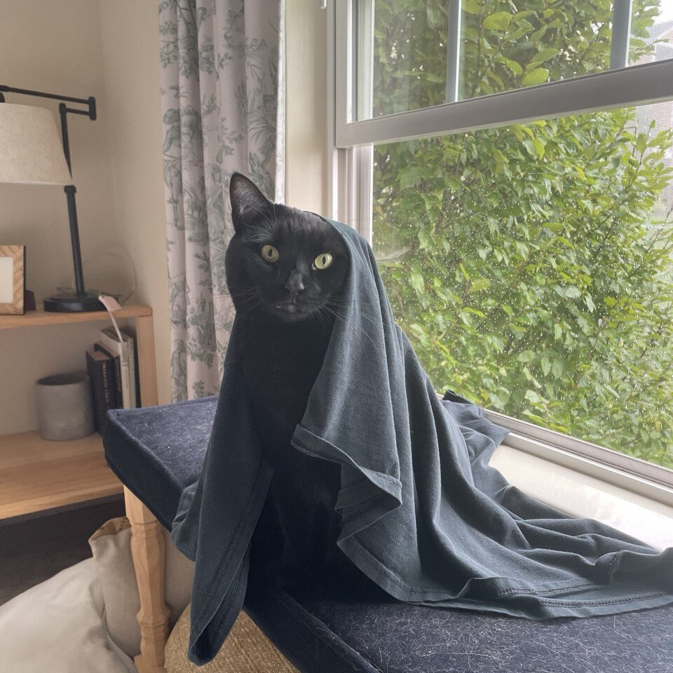
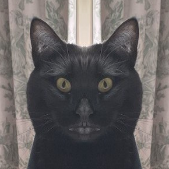
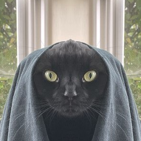

| Input | Left mirror | Right mirror |
|---|---|---|
|  |  |  |

### Usage

1. Upload an image
2. Adjust selection area
3. Download two images

The app is deployed on HF free-tier toaster so it's painfully slow; you can run it locally with:
```
pip install -r requirements.txt
streamlit run app.py
```

### Why

1. I was bored
2. I had tokens
3. Look at that cat

### License

Always MIT
